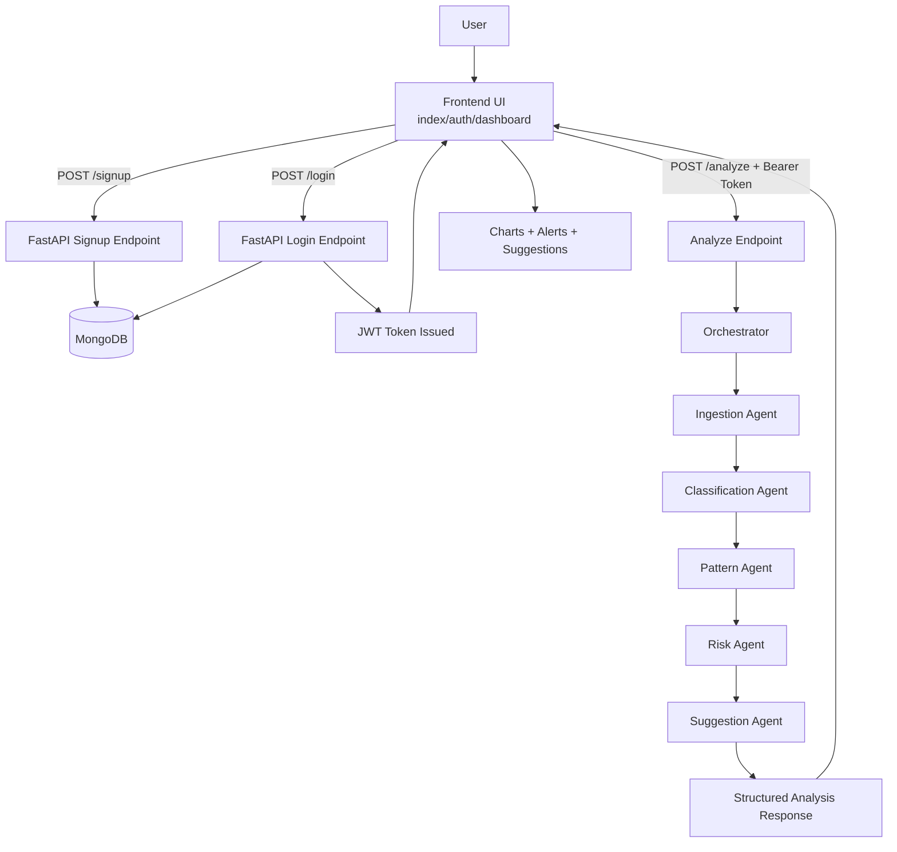
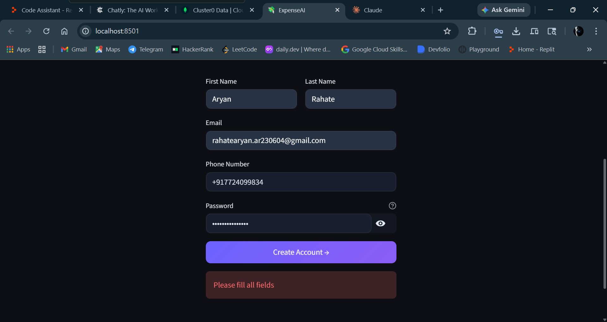

# 💸 ExpenseAI — Agentic AI Expense Management System

> An intelligent, production-ready expense management system powered by a multi-agent AI pipeline using Google Gemini, FastAPI, and MongoDB.

---

## ✨ Features

- 🔐 **Secure Auth** — JWT-based login/signup with bcrypt password hashing
- 🤖 **Multi-Agent AI Pipeline** — Ingestion → Classification → Pattern Detection → Risk Evaluation → Suggestion Generation
- 🧠 **Google Gemini AI** — Smart expense classification and personalized financial suggestions
- 📊 **Interactive Dashboard** — Real-time charts (pie + bar), category breakdown, budget tracker
- 🔔 **Smart Alerts** — Budget overruns, harmful expenses, large transactions
- 🏷️ **Auto-Categorization** — Rule-based + AI fallback classification
- ⚠️ **Risk Scoring** — 0-10 financial risk score with severity indicators
- 📱 **Responsive UI** — Modern dark theme, mobile-friendly layout

---

## 🧱 Tech Stack

| Layer | Technology |
|---|---|
| Backend | FastAPI, Python 3.11+ |
| Database | MongoDB (Motor async driver) |
| Auth | JWT (PyJWT), passlib[bcrypt] |
| AI/LLM | Google Gemini 1.5 Flash via LangChain |
| Agent Orchestration | LangGraph state machine with prompt-driven agents |
| Frontend | HTML5, CSS3, Vanilla JavaScript |
| Charts | Chart.js v4 |

---

## 📁 Project Structure

```text
ExpenseAI_MultiAgent/
├── backend/
│   ├── __init__.py
│   ├── main.py                      # FastAPI app + route handlers + static mounting
│   ├── auth.py                      # JWT create/verify + password hashing
│   ├── config.py                    # App settings and environment loading
│   ├── database.py                  # MongoDB connection lifecycle
│   ├── exceptions.py                # App-level custom exceptions
│   ├── logger.py                    # Structured logging utilities
│   ├── agents/
│   │   ├── orchestrator.py          # LangGraph-style workflow coordination
│   │   ├── state.py                 # Shared pipeline state model
│   │   ├── output_models.py         # Final response/output shapes
│   │   ├── ingestion_agent.py       # Input cleaning and normalization
│   │   ├── classification_agent.py  # Category + essential/non-essential tagging
│   │   ├── pattern_agent.py         # Spending pattern and trend extraction
│   │   ├── risk_agent.py            # Risk score and alert generation
│   │   └── suggestion_agent.py      # AI savings suggestions
│   ├── models/
│   │   └── schemas.py               # Request/response Pydantic models
│   ├── services/
│   │   ├── db_service.py            # User and data persistence operations
│   │   ├── gemini_service.py        # Gemini interaction wrapper
│   │   ├── rag_service.py           # Retrieval-augmented helper service
│   │   └── vector_store.py          # Vector/index support utilities
│   └── utils/
│       ├── helpers.py               # Common helper functions
│       └── validators.py            # Input/domain validation helpers
├── frontend/
│   ├── index.html                   # Landing page
│   ├── auth.html                    # Login/signup UI
│   ├── dashboard.html               # Dashboard UI
│   ├── auth.js                      # Auth actions (signup/login)
│   ├── app.js                       # Dashboard behavior + API calls + chart rendering
│   └── styles.css                   # Shared styling
├── requirements.txt
├── README.md
└── .gitignore
```

---

## ⚙️ Setup Instructions

### 1. Prerequisites
- Python 3.11+
- MongoDB running locally (or MongoDB Atlas URI)
- Google Gemini API key ([get one here](https://aistudio.google.com/))

### 2. Clone & Configure

```bash
git clone https://github.com/yourusername/expense-agent-ai.git
cd expense-agent-ai
```

### 3. Configure Environment Variables

Edit `backend/.env`:

```env
GEMINI_API_KEY=your_gemini_api_key_here
MONGO_URI=mongodb://localhost:27017
SECRET_KEY=your_super_secret_jwt_key_change_this
```

### 4. Install Backend Dependencies

```bash
cd backend
python -m venv venv
source venv/bin/activate        # Windows: venv\Scripts\activate
pip install -r requirements.txt
```

### 5. Run the Backend

```bash
uvicorn backend.main:app --reload --host 0.0.0.0 --port 8000
```

Backend runs at: `http://localhost:8000`  
API docs at: `http://localhost:8000/docs`

### 6. Open the App

The FastAPI server now serves the frontend templates and static assets directly, so open:

```bash
http://localhost:8000/
```

You can also go directly to:

```bash
http://localhost:8000/auth
http://localhost:8000/dashboard
```

---

## 🌐 API Reference

| Method | Endpoint | Auth | Description |
|---|---|---|---|
| POST | `/signup` | No | Register new user |
| POST | `/login` | No | Login, get JWT token |
| POST | `/analyze` | JWT | Run AI expense analysis |
| GET | `/health` | No | Health check |

### Example: Analyze Request

```json
POST /analyze
Authorization: Bearer <token>

{
  "expenses": [
    {"description": "Grocery shopping", "amount": 285.50, "date": "2024-01-15"},
    {"description": "Netflix", "amount": 15.99, "date": "2024-01-15"}
  ],
  "monthly_limit": 3000
}
```

---

## 🔐 Environment Variables

| Variable | Description | Example |
|---|---|---|
| `GEMINI_API_KEY` | Google AI Studio API key | `AIza...` |
| `GEMINI_MODEL` | Gemini model name used by LangChain | `gemini-1.5-flash` |
| `MONGO_URI` | MongoDB connection string | `mongodb://localhost:27017` |
| `SECRET_KEY` | JWT signing secret (change in production!) | `my-secret-key-123` |

---

## 🔄 Project Workflow



---

## 📸 Screenshots



---

## 📄 Documentation
- `auth.html` — Login/Signup page
- `dashboard.html` — Full analytics dashboard with charts and insights

---

## 🚀 Future Improvements

- [ ] Receipt OCR upload (image → expense extraction)
- [ ] CSV/bank statement import
- [ ] Monthly trend analysis & historical graphs
- [ ] Email/SMS alerts for budget overruns
- [ ] Multi-currency support
- [ ] Recurring expense detection
- [ ] Export reports as PDF
- [ ] PWA / Mobile app wrapper
- [ ] Google OAuth integration

---

## 📄 License

MIT License — free to use for personal and commercial projects.
